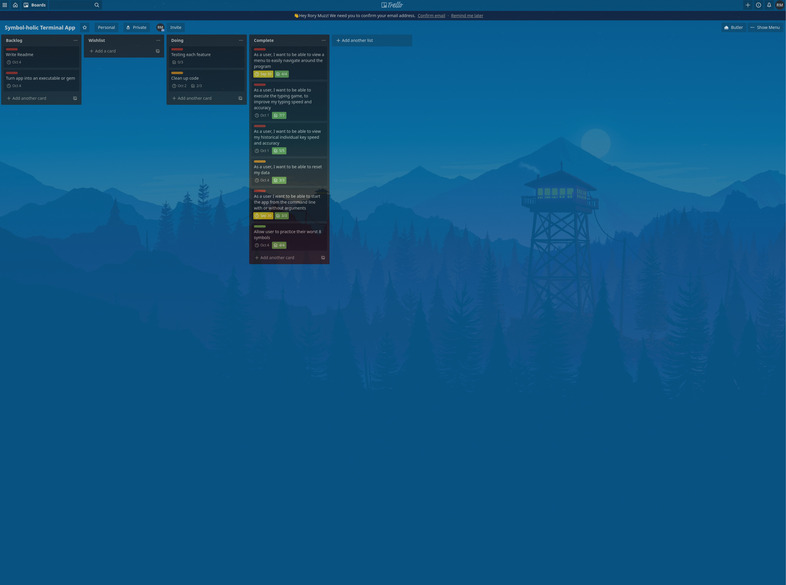

# Readme     

# Github Link
[Symbol-holic github](https://github.com/RoryMusinskas/symbol-holic.git)

# Installation and Setup

This application will only work on Mac and Linux machines.

The list of gem dependencies - which will installed with the gem are:
  - 'byebug', '~> 11.1.3'
  - 'colorize', '~> 0.8.1'
  - 'json', '~> 2.3', '>= 2.3.1'
  - 'terminal-table', '~> 1.8'
  - 'tty-pie', '~> 0.4.0'
  - 'tty-prompt', '~> 0.22.0'
  - 'tty-reader', '~> 0.8.0'

### Install instructions  
1. Install ruby, I recommend using asdf. Here is the link and instructions [asdf](https://github.com/asdf-vm/asdf).
2. Download and install RubyGems [RubyGems](https://rubygems.org/pages/download), this will be pre-installed with ruby version 1.9 and newer.
3. Install the symbol-holic gem ``` gem install symbol-holic ```
4. Run symbol-holic from the command line ``` symbol_holic ``` -- Note the underscore. You can reference [User interaction](#outline-of-the-user-interaction-for-the-application) for optional command line arguments.

### Testing Symbol-holic
IF you would like to test Symbol-holic, 
1. Read my testing spreadsheet [testing spreadsheet](https://docs.google.com/spreadsheets/d/1xANGPhYvJSgFWg9ozXUHm3roL2j6DLn7pCjj7a975os/edit?usp=sharing) to see what is manually and automatically tested.
2. Install git, follow these instructions [git install](https://git-scm.com/book/en/v2/Getting-Started-Installing-Git)
3. Git clone the app to your desired location ``` git clone https://github.com/RoryMusinskas/symbol-holic.git ```
4. Install rspec ``` gem install rspec ```
5. Navigate to the spec folder within symbol-holic and run ``` rspec -fd 'file you want to test' ```

   

# Software Development Plan 

### High Level Description
Symbol-holic is a lightweight, very simple and specific program to train-muscle memory when typing symbols on the keyboard and it is designed to train users through specific repetition of typing. It has two typing game modes, one which provides a random selection of all symbols on the keyboard and a second game which takes the users 8 symbols they need to improve most and displays them multiple times to train them specifically.
### Target Problem
There are a lot of typing games on the market which focus on the alphabet characters on the key-board, but there is a need for an typing game which focusses solely on symbols, welcome Symbol-holic. When I starting programming, I found that I was making lots of errors trying to type symbols, as it was never something that I had really needed to focus on before, so I needed a way to do targeted practice and see statistics on each key, rather than practicing on the fly and measuring performance on anecdotal evidence.

### Target Audience 
The target audience for this program is anyone that is struggling with accuracy and speed when typing symbols. Programmers would most likely be biggest beneficiaries, as they spend a large amount of their day typing symbols.  Through some hard work and effort, the users of this program should see drastic changes in their symbol metrics. 
 
### Target audience use instructions
The target audience will download and install the program, which is a ruby gem. From there the user can run the program from the console, with 1 optional argument of the following: (-h or --help) for a help screen, (-d or --display) to display their typing statistics, (-r or --run) to run the standard typing game or (-t or --targeted) to run the targeted typing game. If users enter the menu, they can select to start the standard typing game, the targeted typing game, view their typing statistics, reset their data or exit the program. If they choose the standard typing game, they will be presented with 15 symbols to type as quickly and accurately as possible. If they choose the targeted typing game, they will be presented with 24 symbols to type, which are their 8 lowest scoring keys, all displayed three times each. 


## List of features

### List of three features  
- Two typing modes
- Persistent data
- Intuitive and simple user-interface menu

## Description of each feature 
### Two typing modes
There is two different typing modes that the user can utilize to improve their symbol typing speed and accuracy. The normal mode will generate 15 random symbols from all available symbols on a keyboard and the targeted game will pick the 8 keys the user can improve the most and displays them 3 times each, this encourages the user to improve through repetition. Both game modes will then display each symbol one after another once the user has correctly input the proceeding symbol. It times how long the user takes to input the correct symbol and it also stores how many attempts it takes the user, this will form the accuracy for the persistent data storage.

### Persistent data storage
One of vital parts that will help the user improve is them being able to track their progress and scores over a period of time. This allows them to analyze which keys may need to be focussed on more for either more speed or for better accuracy, both of which are tracked on Symbol-holic. The program has an easy and intuitive interface which allows the user to display their statistics in a terminal table. The more games the user plays, the more accurate this data will become as it averages out, but if the user would like to delete their data and start again, there is an option to accomplish this.

### Intuitive and simple user-interface menu
One of the main design philosophies with symbol-holic is a very simple and intuitive user interface. This moulded the way the program was developed and I chose to implement TTY-Prompt as the user interface menu. This allows the user to easily navigate around the program with the use of their arrow keys and the generated prompts. Allowing the user to navigate in this manner increases user accessibility by not requiring them to remember and type numbers or letters to move through the interface.

## Outline of the user interaction for the application

### How the user will find out how to interact with / use each feature
The user has the ability to read about the programs features in the help description, accessed by adding the '-h' or '--help' argument to the command line when executing the program, eg. ``` symbol_holic -h ```, ``` symbol_holic --help ```. If users enter an invalid argument, they will receive a prompt suggesting them to execute the help screen.

### How the user will interact with each feature
One of the main design philosophies with symbol-holic is a very simple and intuitive user interface. This moulded the way the program was developed and I chose to implement TTY-Prompt as the user interface menu. This allows the user to easily navigate around the program with the use of their arrow keys and the generated prompts. The user can also add the following command line arguments when executing the program: '-r' or '--run' (``` symbol_holic -r ``` or ``` symbol_holic --run ```) to execute the normal typing game, '-t' or '--targeted' (``` symbol_holic -t ``` or ``` symbol_holic --targeted ```) to execute the targeted typing game and finally they can add '-d' or '--display' (``` symbol_holic -d ``` or ``` symbol_holic --display ```) to display their statistics to the command line. 

### How errors will be handled by the application and displayed to the user
Errors found in the application are handled by a exception rescue handling. Below are two examples:


TypeError handling:
```ruby
  # Make a pie chart for the hit and miss count
  def make_pie_chart(total_hit, total_miss)
    data = [
      { value: total_hit, color: :bright_green, fill: '•' },
      { value: total_miss, color: :bright_red, fill: '•' }
    ]
    # Create the pie chart
    pie_chart = TTY::Pie.new(data: data, radius: 2)
    pie_chart.render
    # It will throw a type error for nil values, in that case return a string
  rescue TypeError
    'no data yet'
  end
```

JSON::ParserError handling:
```ruby
  # Added in for the command line arguments. We can call display_statistics on menu and not create a new TypingStatistics instance
  def display_statistics
    # If the user hasn't played a game yet, there is no need to display their typing scores
    # It throws a JSON::ParserError as the file is empty and cannot be parsed
    @typing_statistics.display_statistics
    # If it is not empty, display their statistics
    # If it is empty, display a prompt and let them choose another menu item
  rescue JSON::ParserError
    puts
    puts "You haven't played a game yet. Please play one game and then try again.".colorize(:red)
    puts
  end
```

## Develop a diagram which describes the control flow of the application.


### Develop an implementation plan on trello
Please have a look at the trello board utilized for this project;
[Trello board finshed](https://trello.com/b/y9t6KNGz/symbol-holic-terminal-app)

Here is a screen shot of the trello mid project

